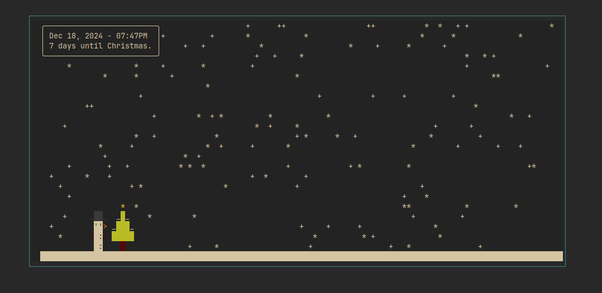

# Snowman Terminal Screensaver

Use `cargo run` to get a snowman, a tree, and snowfall as your terminal screensaver, with a surprise on Christmas.

Optionally, control the snowfall intensity with the `-i`/`--intensity` argument:

`cargo run -- -i [low/medium/high]`
